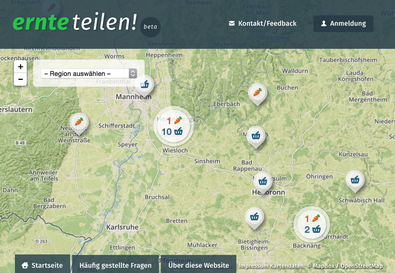

# Teikei

Teikei is the software that powers [Ernte teilen][ernteteilen], a website that maps out [Community Supported Agriculture][csa] in Germany.

## Getting started

The framework consists of two components: the API back-end and the front-end. The back-end is based on [Ruby on Rails][rubyonrails]. Data is exchanged as JSON. The front-end is built with the help of [Marionette.js][marionettejs] and [Backbone.js][backbonejs]. The website is designed to work as a single-page-application, at least for the major parts of the interface.

The frontend webpack build is an ejected version of [create-react-app][create-react-app] with added Sass support.

### Settings

You need to create an `.env` file in the root directory which contains the environment variables needed to run the project. The included `.env.sample` file lists the variables which need to be set.

### External dependencies (package managers)

This application uses separate package management for its client-side dependencies. In order to build the front-end of this application, you will need [npm][npm] (part of node.js) in addition to Bundler. NPM will install all external client-side packages into the `node_modules` folder.

#### Installing/updating dependencies:

1. Run `bundle install` in the "server" subdirectory (installs Ruby dependencies)
2. Run `yarn install` inside the "client" subdirectory (installs client-side dependencies)

#### Running in development mode

* To start the application in development mode run `./teikei.sh dev`
* Open http://localhost:8000. The frontend express server runs on port 8000 and will proxy request to the Webpack Dev Server on port 8001 and backend requests to the Rails server running on port 3000.

#### Running in production mode

* Build the project for production with `./teikei.sh build`
* Start in production mode (after building the project) with `./teikei.sh prod`
* Open http://localhost:3000 to access the Rails server runnning in production mode.
* Revert to the initial state with `./teikei.sh clean`

### Test data

* A superadmin account can be generated by running `rake db:seed`.
* Test data in general (users, farms, depots, faqs) can be generated by running `rake db:seed:generate`.
* The task `rake db:seed:all` runs both tasks mentioned before.

## Roadmap

We use [the GitHub issue tracker](https://github.com/teikei/teikei/issues) to plan upcoming features and track our bugs. If you want to participate, it's probably a good idea to look for open issues there. Before working on bigger features, however, it's advisable to get in contact with us, so that we can coordinate progress a little.

## Known issues

- On Ubuntu there might be an issue running `bundle install`. There is a dependency for `libcrypto.so.0.9.8`. To circumvend the problem install `libssl0.9.8`.
- We can only upgrade to Ruby 2.4 after we've upgraded to Rails 5.

## Authors & contributors

* [Simon Jockers][sjockers]
* [Christian Rijke][cnrk]
* [Tobias Preuss][johnjohndoe]
* [Daniel Mack][zonque]

## License

* The Teikei source code is released under the [AGPL 3.0](https://www.gnu.org/licenses/agpl-3.0.html)
* Assets in this repository are released under the [Attribution-ShareAlike 4.0 International CC license](http://creativecommons.org/licenses/by-sa/4.0/)

[ernteteilen]: https://ernte-teilen.org
[csa]: http://en.wikipedia.org/wiki/Community-supported_agriculture
[sjockers]: https://github.com/sjockers
[cnrk]: https://github.com/cnrk
[johnjohndoe]: https://github.com/johnjohndoe
[zonque]: https://github.com/zonque
[trello]: https://trello.com
[rubyonrails]: http://rubyonrails.org
[backbonejs]: http://backbonejs.org
[marionettejs]: http://marionettejs.com
[bower]: http://bower.io
[nodejs]: http://nodejs.org
[create-react-app]: https://github.com/facebookincubator/create-react-app
