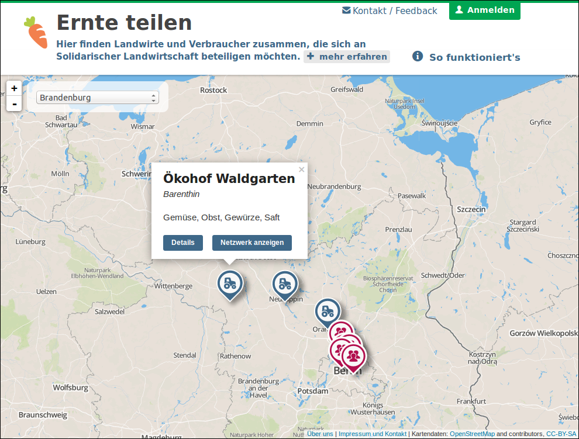

  

# Teikei

A web application for managing groups and farmers following the idea of [community-supported agriculture (CSA)][csa]. The framework is used for the [Ernte teilen][ernteteilen] website which is shown in the screenshot.

## Getting started

The framework consists of two components: the API back-end and the front-end. The back-end is based on [Ruby on Rails][rubyonrails]. Data is exchanged as JSON. The front-end is built with the help of [Marionette.js][marionettejs] and [Backbone.js][backbonejs]. The website is designed to work as a single-page-application, at least for the major parts of the interface.

### Settings

* You need to create an `.env` file which contains the environment variables needed to run the project. The included `.env.sample` file lists the variables which need to be set.

### Test data

* A superadmin account can be generated by running `rake db:seed`.
* Test data in general (users, farms, depots, faqs) can be generated by running `rake db:seed:generate`.
* The task `rake db:seed:all` runs both tasks mentioned before.

## Roadmap

We use [Trello][trello] to plan upcoming features. Our project there is not public yet.

## Known issues

On Ubuntu there might be an issue running `bundle install`. There is a dependency for `libcrypto.so.0.9.8`. To circumvend the problem install `libssl0.9.8`.

## Authors & contributors

* [Simon Jockers][sjockers]
* [Christian Rijke][cnrk]
* [Tobias Preuss][johnjohndoe]
* [Daniel Mack][zonque]

## License

* The Teikei source code is released under the [AGPL 3.0](https://www.gnu.org/licenses/agpl-3.0.html)
* Assets in this repository are released under the [Attribution-ShareAlike 4.0 International CC license](http://creativecommons.org/licenses/by-sa/4.0/)

[ernteteilen]: https://ernte-teilen.org
[csa]: http://en.wikipedia.org/wiki/Community-supported_agriculture
[sjockers]: https://github.com/sjockers
[cnrk]: https://github.com/cnrk
[johnjohndoe]: https://github.com/johnjohndoe
[zonque]: https://github.com/zonque
[trello]: https://trello.com
[rubyonrails]: http://rubyonrails.org
[backbonejs]: http://backbonejs.org
[marionettejs]: http://marionettejs.com
